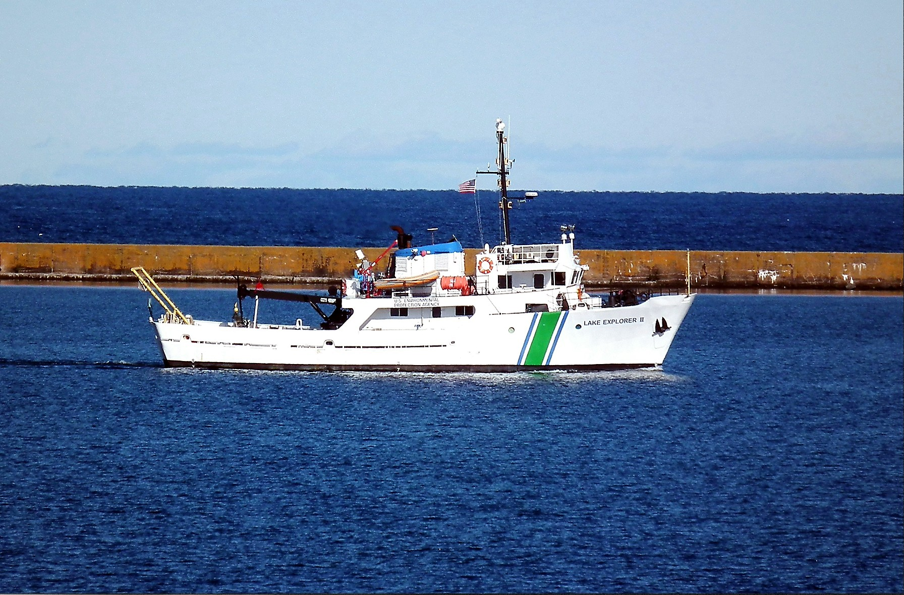
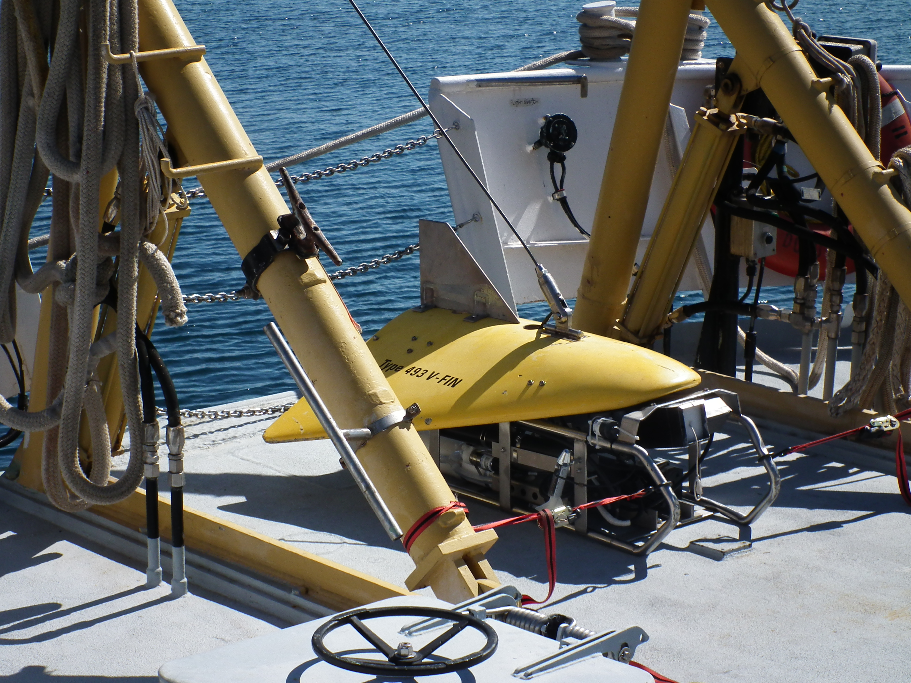
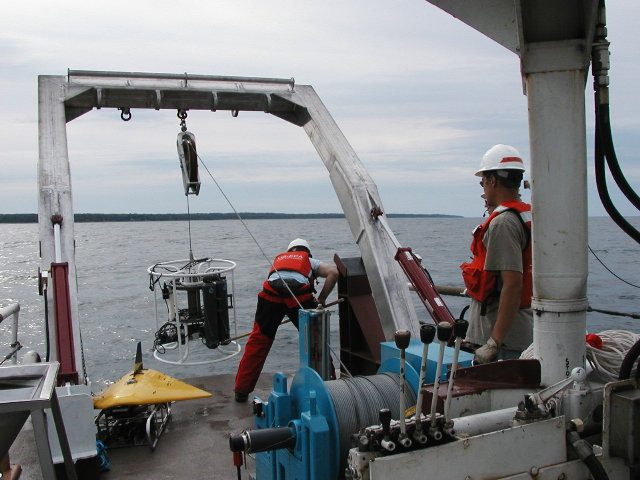
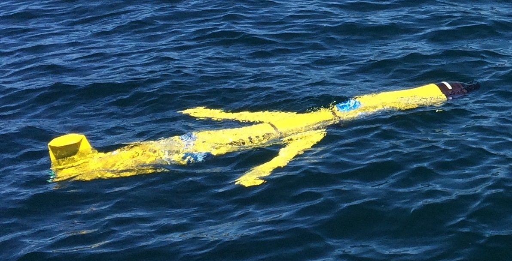
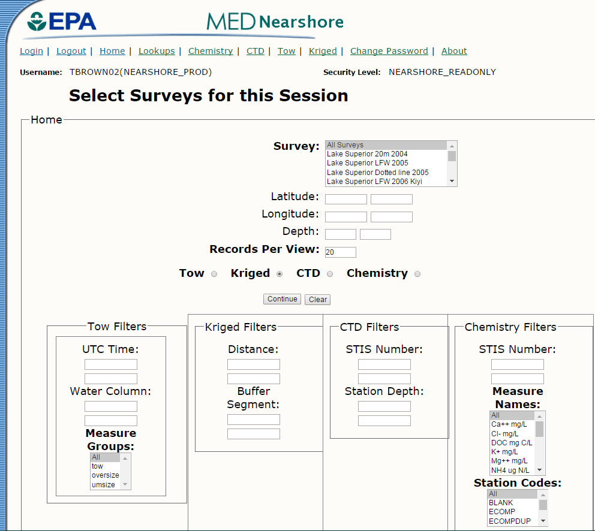
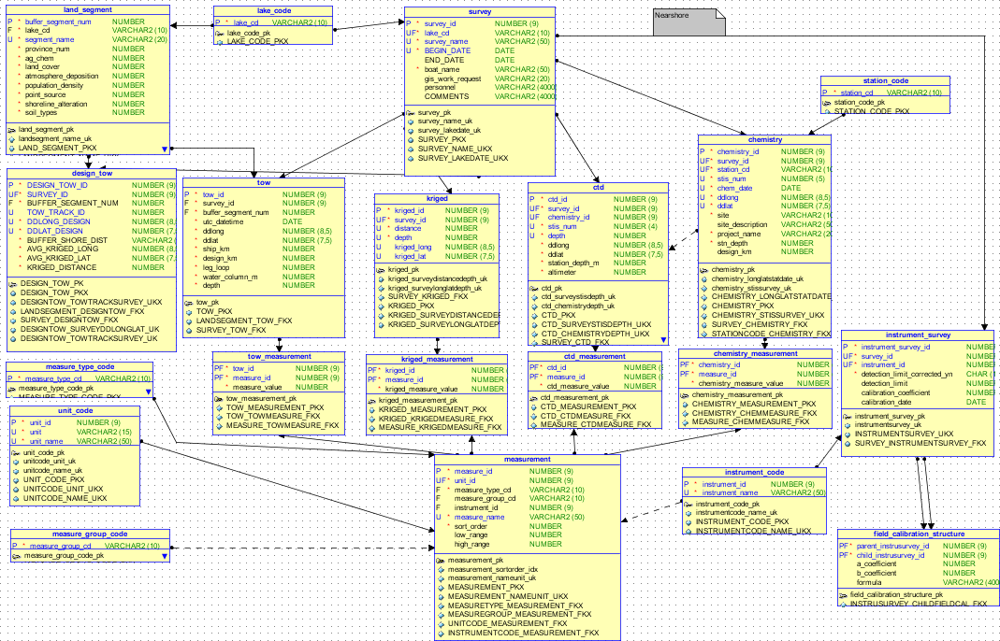

# Visualizing and managing   high frequency   3D aquatic data

[Brown.TerryN@epa.gov](mailto:Brown.TerryN@epa.gov)

http://tbnorth.github.io/cesium_aquatic

## Data source - boat with a winch

## Data management

## DB structure

## Data visualization

<!-- [WebGL](https://www.youtube.com/embed/P5NLa18R_Gw) -->

[Watershed / tow correlation](http://beaver.nrri.umn.edu/~tbrown/tow2ws/Tows.html)

[Glider viz.](https://gliderviz.apps.cloud.gov/)

<!-- [Near shore DB](http://q2626xmnay001.aa.ad.epa.gov/nearshore/home.cfm) -->

[LLO gliders](http://d.umn.edu/buoys/gliders.php)

[Paleo population](http://beaver.nrri.umn.edu/~tbrown/time/Apps/Sandcastle/index.html?src=Paleo.html&label=Showcases)

## Other features

 - CZML, like KML but more time dynamic
 - point cloud (100k+ points) visualization
 - occlusion based rendering of millions of buildings etc.
 - play timeline synchronized video
